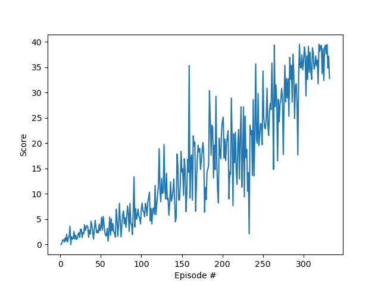
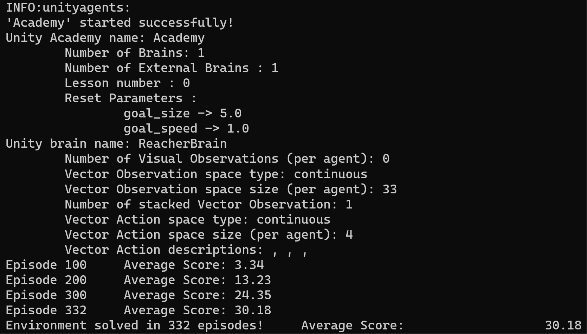
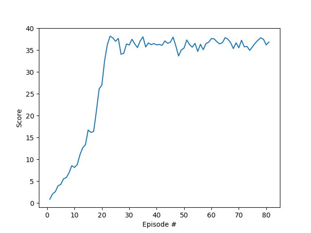
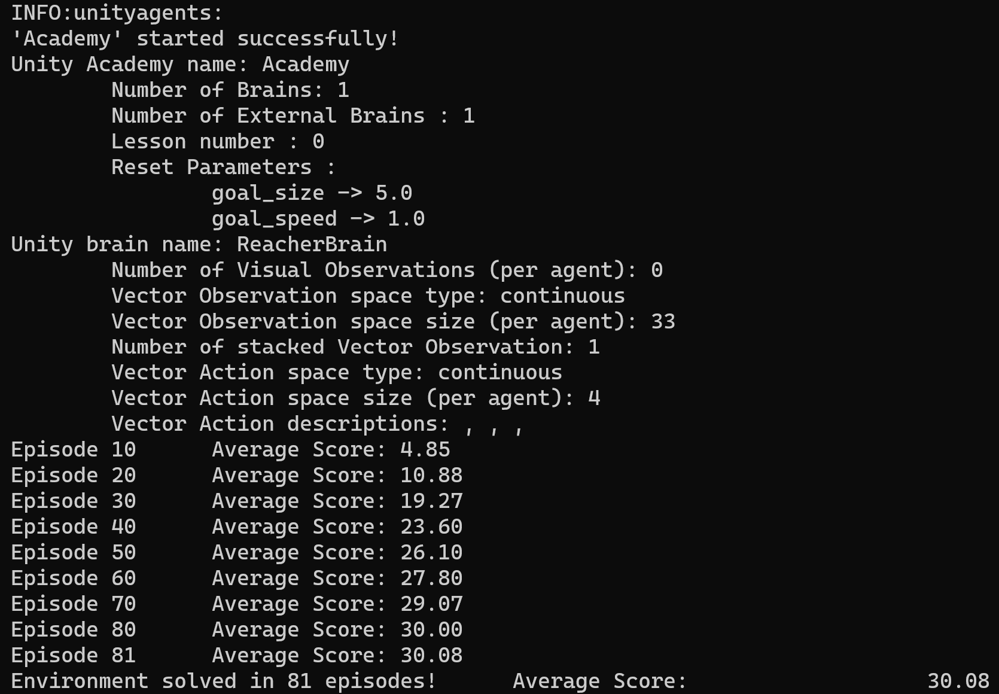

# Project Report

## Learning Algorithm
The implementation of this project is based on the deep deterministic policy gradient (DDPG) algorithm. It's an 
actor-critic, model-free algorithm based on the deterministic policy gradient algorithm but can operate over continuous
action spaces. 

### Model Architecture and Training
The actor- and critic networks are both feedforward neural networks consisting of two hidden layers, one batch
normalization layer between the first and the second hidden layer, and an output layer. Both hidden layers consist of
128 neurons. The actor network's output layer is made up of four neurons (size of the action space) and the critic's
output (the Q-value) is provided by one neuron. Inside the networks a ReLU activation function is used. As the action 
values are between -1 and 1, tanh is used as activation function on the output of the actor network. The
critic network feeds the actions not in the first, as it does with the states, but only in the second hidden layer.

Both, the actor and the critic network consist of a local (regular) and target network. The target network is softly
updated with the weights of the local network after every time step. 

Training is started after the replay buffer contains enough samples to deliver at least a full batch of samples and only
after 20 time steps were elapsed after the last training cycle to collect further samples. Inside a training cycle 
learning takes place 10 times before collecting further experiences from the environment. Both hyperparameters
(**update_every** and **network update**) can be configured in config.yml.

Decreasing Gaussian noise is added to the actions while training the model to allow exploratory behaviour.

### Hyperparameters
For learning the agent the following hyperparameters where used:

* n_episodes: 1000
* max_timesteps: 1000
* buffer_size: 100000
* batch_size: 128
* update_every: 20
* network_update: 10
* gamma: 0.95
* tau: 1.0E-3
* lr_actor: 1.0E-3
* lr_critic: 1.0E-3
* weight_decay: 0.0
* ou_mu: 0.0
* ou_theta: 0.15
* ou_sigma: 0.08
* scores_window: 100

Details about the meaning of each hyperparameter can be found in the file 
config.yml.

## Plot of Rewards
The following figures show the reward plots, the training outputs and the 
number of episodes to solve the environment of the final models for the
one-agent and twenty-agent environment, respectively:

    
    
   
  <em> Reward plot for one-agent training and the corresponding training output. Environment was solved after 332 episodes.</em>

  
  
   
  <em> Reward plot for twenty-agent training and the corresponding training output. Environment was solved after 81 episodes.</em>

## Ideas for Future Work
Further hyperparameter tuning and the implementation of other actor-critic algorithms like A3C or D4PG can be investigated to improve the agent's performance.
